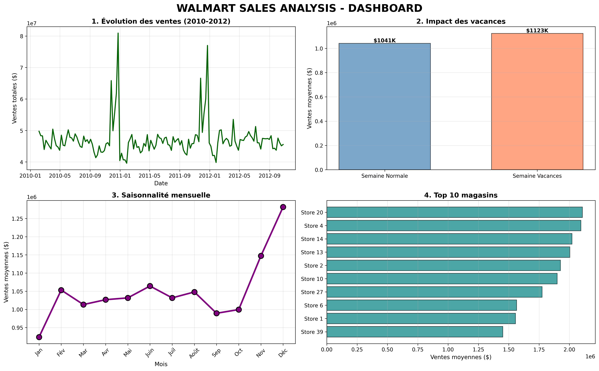
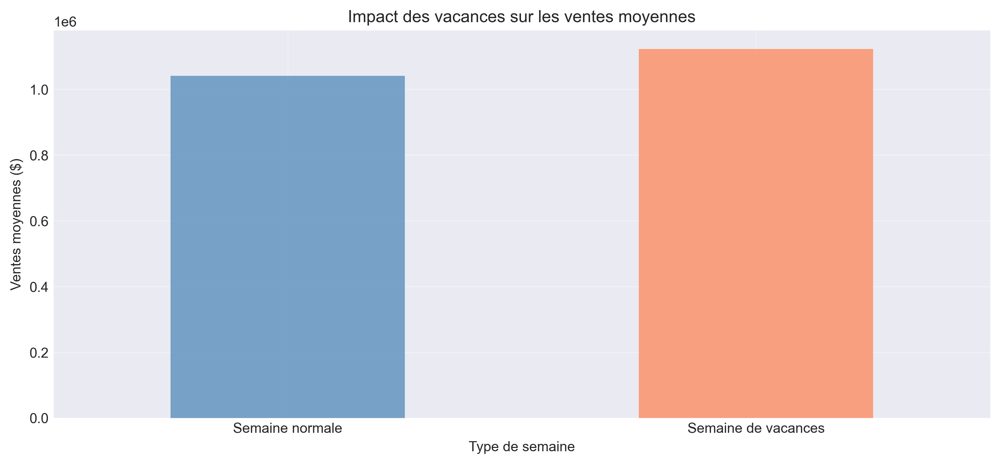
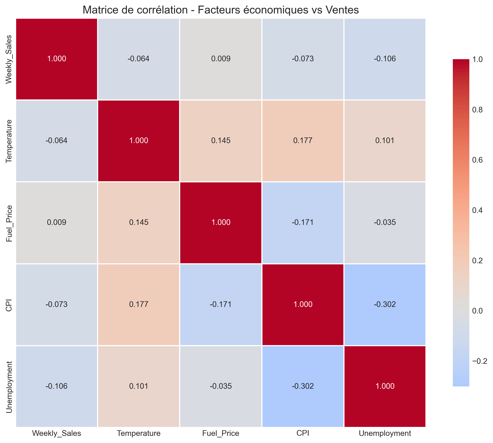
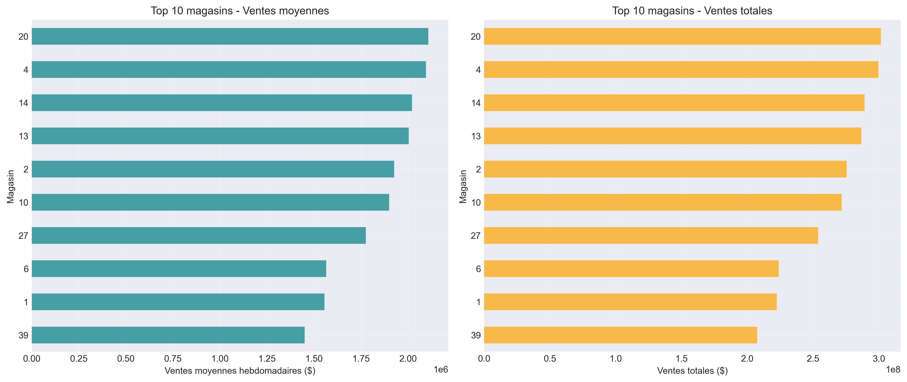

# Walmart Sales Analysis

Analyse complète de **6,434 enregistrements** de ventes hebdomadaires de 45 magasins Walmart (2010-2012) pour identifier les tendances temporelles, l'impact des facteurs économiques et optimiser les performances commerciales.



---

## Objectifs du Projet

Ce projet vise à :

1. **Analyser les tendances de ventes** sur 3 ans pour identifier les patterns temporels
2. **Mesurer l'impact des vacances** sur les performances commerciales
3. **Évaluer l'influence des facteurs économiques** (chômage, inflation, prix du carburant)
4. **Identifier la saisonnalité** pour optimiser la gestion des stocks
5. **Comparer les performances** entre différents magasins

---

## Résultats Clés

- **6,434 enregistrements** de ventes hebdomadaires analysés
- **45 magasins** Walmart suivis sur 3 ans (2010-2012)
- **Impact des vacances :** Augmentation significative des ventes durant les périodes de vacances
- **Saisonnalité forte :** Pics de ventes identifiés en fin d'année
- **Facteurs économiques :** Corrélations identifiées entre ventes et indicateurs économiques locaux
- **Disparités géographiques :** Variation importante de performance entre magasins

---

## Technologies Utilisées

- **Python 3.10**
- **Pandas** - Manipulation de données et analyse temporelle
- **Matplotlib & Seaborn** - Visualisations de données
- **NumPy** - Calculs numériques
- **Jupyter Notebook** - Analyse interactive et documentation

---

## Structure du Projet
```
walmart-sales-analysis/
│
├── data/
│   ├── raw/                          # Données brutes
│   │   └── Walmart_Sales.csv
│   └── processed/                    # Données nettoyées et enrichies
│       └── walmart_enriched.csv
│
├── notebooks/
│   ├── 01_complete_analysis.ipynb   # Exploration et analyses principales
│   └── 02_visualizations.ipynb      # Dashboard et visualisations finales
│
├── visualizations/
│   ├── sales_distribution.png
│   ├── holiday_impact.png
│   ├── sales_trends.png
│   ├── correlation_heatmap.png
│   ├── store_comparison.png
│   └── dashboard_complet.png        # Dashboard final
│
├── reports/
│   └── walmart_analysis_report.md   # Rapport d'analyse détaillé
│
├── src/
│   ├── __init__.py
│   ├── data_loader.py
│   ├── data_cleaner.py
│   └── visualization.py
│
├── .gitignore
├── README.md
├── requirements.txt
└── LICENSE
```

---

## Installation et Utilisation

### 1. Cloner le repository
```bash
git clone https://github.com/Softwinnerr/walmart-sales-analysis.git
cd walmart-sales-analysis
```

### 2. Installer les dépendances
```bash
pip3 install -r requirements.txt
```

### 3. Lancer Jupyter Notebook
```bash
python3 -m jupyter notebook
```

### 4. Exécuter les notebooks

Ouvrir et exécuter les notebooks dans l'ordre :
1. `01_complete_analysis.ipynb` - Exploration complète et analyses
2. `02_visualizations.ipynb` - Dashboard de visualisations finales

---

## Analyses Principales

### 1. Tendances Temporelles

Analyse de l'évolution des ventes sur 3 ans révélant :
- **Croissance progressive** de 2010 à 2012
- **Saisonnalité marquée** avec pics récurrents en fin d'année
- **Stabilité relative** avec variations prévisibles

### 2. Impact des Vacances



Les semaines de vacances montrent :
- **Augmentation significative** des ventes comparé aux semaines normales
- **Impact particulièrement fort** durant les périodes de fêtes de fin d'année
- **Opportunité business** pour optimiser stocks et marketing

### 3. Saisonnalité Mensuelle

Identification des patterns mensuels :
- **Pics de ventes** en fin d'année (Q4)
- **Creux** en début d'année post-fêtes
- **Prévisibilité** permettant une planification optimale

### 4. Facteurs Économiques



Corrélations identifiées entre ventes et :
- **Taux de chômage** - Impact sur le pouvoir d'achat
- **Prix du carburant** - Influence modérée
- **Indice des prix** (CPI) - Relation avec l'inflation
- **Température** - Effet saisonnier

### 5. Comparaison des Magasins



- **Disparités importantes** entre magasins
- **Top performers** identifiés pour analyse des best practices
- **Opportunités d'optimisation** pour magasins sous-performants

---

## Insights Business

### Insights Clés

1. **Saisonnalité prévisible**
   - Les patterns mensuels sont constants année après année
   - Permet une planification précise des stocks et du personnel

2. **Levier vacances**
   - Les périodes de vacances offrent un boost significatif des ventes
   - Justifie des investissements marketing ciblés avec ROI élevé

3. **Impact économique local**
   - Le contexte économique (chômage, inflation) affecte directement les ventes
   - Nécessite une adaptation stratégique selon les conditions locales

4. **Disparités géographiques**
   - Les performances varient fortement entre magasins
   - Opportunité d'appliquer les best practices des top performers

5. **Croissance positive**
   - Tendance à la hausse observable sur la période 2010-2012
   - Indicateur de santé commerciale globale

### Recommandations

**Court terme (0-3 mois) :**
- Ajuster les stocks selon la saisonnalité identifiée (+20-30% avant vacances)
- Renforcer le personnel durant les périodes de forte affluence
- Lancer des promotions ciblées durant les mois faibles

**Moyen terme (3-6 mois) :**
- Analyser les best practices des top performers
- Optimiser l'allocation d'inventaire par magasin
- Développer des prévisions basées sur les patterns identifiés

**Long terme (6-12 mois) :**
- Implémenter un modèle prédictif de ventes (ML)
- Créer un dashboard interactif pour monitoring en temps réel
- Intégrer des données démographiques pour analyses plus fines

---

## Dashboard Final

Le dashboard complet inclut :

1. **Évolution temporelle** - Tendance des ventes sur 3 ans
2. **Impact des vacances** - Comparaison semaines normales vs vacances
3. **Saisonnalité mensuelle** - Pattern mensuel des ventes


---

## Rapport Détaillé

Le rapport d'analyse complet est disponible dans [`reports/walmart_analysis_report.md`](reports/walmart_analysis_report.md)

Il comprend :
- Méthodologie détaillée
- Résultats d'analyse approfondis
- Insights business actionnables
- Recommandations stratégiques

---

## Développements Futurs

### Améliorations possibles

- [ ] **Modèle prédictif ML** - Prévision des ventes avec régression/time series
- [ ] **Dashboard interactif** - Application Streamlit ou Dash
- [ ] **Analyse causale** - Impact précis de chaque facteur économique
- [ ] **Données enrichies** - Intégration de données démographiques/météo
- [ ] **Alertes automatiques** - Système de notification pour anomalies
- [ ] **API REST** - Service de prévision de ventes

### Extensions envisagées

- Analyse comparative multi-enseignes
- Optimisation d'inventaire par machine learning
- Système de recommandation de promotions
- Analyse de séries temporelles avancée (ARIMA, Prophet)

---

## Auteur

**Jeremie Konan**

Étudiant en informatique passionné par la data science et l'analyse de données

- GitHub: (https://github.com/Softwinnerr)
- LinkedIn:(https://linkedin.com/in/jeremie-konan)
- Email: jeremiesofty24@gmail.com

---

## Remerciements

- Dataset source: Walmart Sales Data
- Inspiration: Analyses retail et séries temporelles
- Outils: Python, Pandas, Matplotlib, Seaborn, Jupyter

---

## Ressources

- [Documentation Pandas](https://pandas.pydata.org/docs/)
- [Matplotlib Gallery](https://matplotlib.org/stable/gallery/index.html)
- [Seaborn Tutorial](https://seaborn.pydata.org/tutorial.html)
- [Time Series Analysis](https://www.statsmodels.org/stable/tsa.html)

---

*Dernière mise à jour: Novembre 2025*